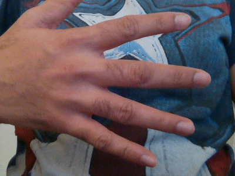
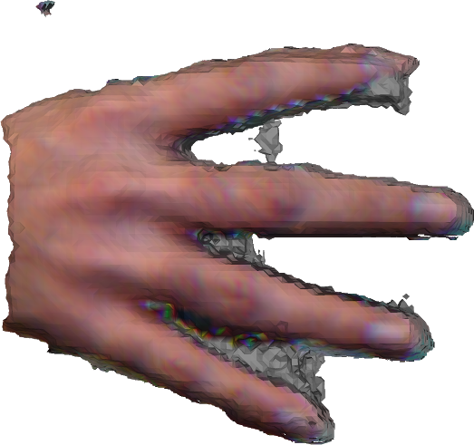

CUDA Implementation of Killing Fusion, from the [paper](http://campar.in.tum.de/pub/slavcheva2017cvpr/slavcheva2017cvpr.pdf)

For a short intro about Killing Fusion and its demo, see [slides](https://docs.google.com/presentation/d/1TBgLGjWb0qFnOnu62y5gTrjaQ_Zr7RKKAt6vqLHQEuc/edit?usp=sharing)

To build the code, from the repository folder perform the following steps: 

mkdir build 
cd build
cmake all -DEIGEN_INCLUDE_DIR="./../third_party/include/eigen3" ..
make

For running the code: 

Download, for example, the Snoopy dataset: http://campar.in.tum.de/personal/slavcheva/deformable-dataset/data/Snoopy.zip.
Extract the dataset to <repo>/data/snoopy folder.

Download the camera intrinsics parameters for the Snoopy dataset from : http://campar.in.tum.de/personal/slavcheva/deformable-dataset/data/intrinsics_kinect1.txt
Place the camera intrinsics file in <repo>/data/snoopy

Create a result folder at <repo>/build/bin/result to save the final meshes. It has to be this path, because it is hardcoded for now.  

Finally run the optimization:

./bin/killingfusion -i ../data/hand/ -b 2 -f 22 -n 1000 -wk 0.1 -ws 0.05 -a 0.1

Details about the input flags
-i   <path>     input dataset path
-b   <integer>  first frame index, which is the canonical model
-f   <integer>  last frame index of the sequence
-n   <integer>  max number of Gradient Descent steps
-wk  <float>    killing term weight
-ws  <float>    level set term weight
-a   <float>    parameter to control rigidness in deformation field
-d              activates debug mode, which saves intermediate data and prints energies
